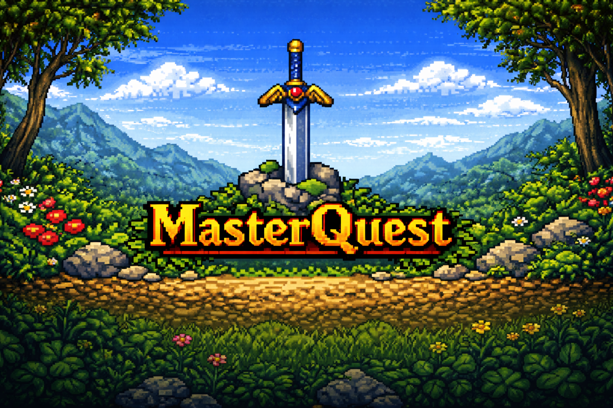
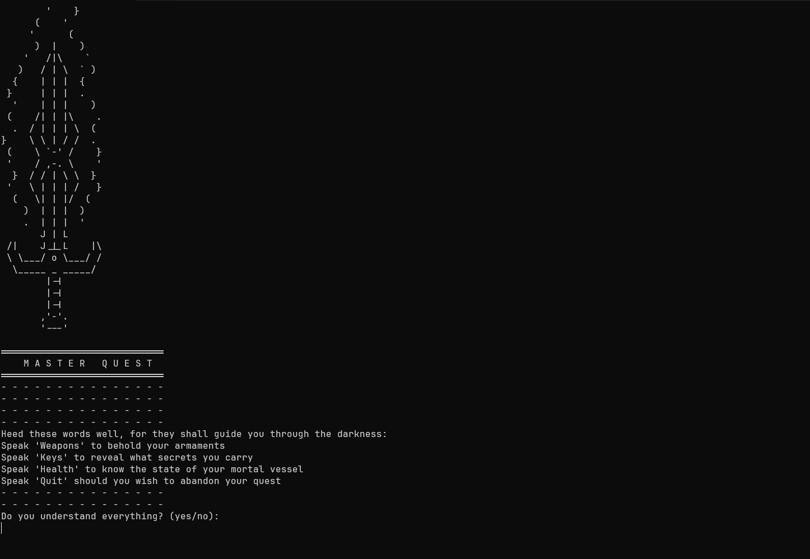

<div align="center">

# ⚔️ MasterQuest: A Journey Through Darkness

**Where old-school dungeon crawling meets modern Object-Oriented Programming.** A text-based, turn-based RPG built with clean Java architecture, strategic combat, hidden secrets, and player agency at its core.

</div>

## 💡 Description

I built MasterQuest to demonstrate that **simplicity doesn't mean sacrificing quality**. This is a classic text-based RPG that proves you can create an engaging, atmospheric game while maintaining clean OOP principles, proper separation of concerns, and thoughtful game design.

Step into a dark dungeon where every choice matters. Battle fierce enemies, solve ancient puzzles, uncover hidden secrets, and face the Lord of Shadow in an epic final confrontation. But beware—death is swift, and the wrong answer can mean instant doom.

This isn't just a simple text game—it's a showcase of **Object-Oriented Design**, **turn-based combat mechanics**, **branching narratives**, and **player choice**, proving that even terminal-based games can deliver depth and atmosphere.

### Key Design Highlights:

- **Clean OOP Architecture:** Proper class hierarchy with `Enemy` superclass extended by `Goblin`, `Firedemon`, and `FinalBoss`. Separate `Hero`, `Weapon`, `Key`, and `Room` entities following single-responsibility principles.
- **Separation of Concerns:** The `Messages` class handles all narrative text, `GameLogic` manages game flow and state, and entity classes focus on their domain responsibilities. No spaghetti code here.
- **Turn-Based Combat System:** Strategic weapon selection with damage ranges. Choose your weapon wisely—different enemies require different tactics.
- **Player Choice & Consequences:** Multiple decision points with real stakes. Puzzles with instant-death penalties, optional secrets (like the angel statue buff), and branching paths.
- **Atmospheric Storytelling:** Over 1000 lines of carefully crafted narrative text that builds tension, creates ambiance, and makes you *feel* the dungeon's darkness.
- **Hidden Secrets:** Discover the four-element puzzle, unlock divine blessings, and find optional power-ups that make the difference between victory and oblivion.
- **Progressive Difficulty:** Three major boss battles with escalating challenge—from the goblin Azak (100 HP) to the firedemon Banzkar (300 HP) to the Lord of Shadow himself (1000 HP).
- **State Management:** Boolean flags and integer counters track player progress, room visits, puzzle solutions, and weapon limitations across the entire campaign.

---

## 🧰 Tech Stack

<p align="center">
  
  
  
</p>

---

## 🎯 Features

### ⚔️ Turn-Based Combat

- **Strategic Weapon System:** Choose from Dagger, Fireball, Truestriker, and the legendary HolyHymn
- **Damage Ranges:** Each weapon has min/max damage using RNG for combat variety
- **Enemy AI:** Enemies attack with randomized damage, testing your health management
- **Weapon Progression:** Unlock more powerful weapons by defeating bosses and solving puzzles

### 🧩 Puzzles & Secrets

- **Riddles with Consequences:** Answer incorrectly and face instant death
- **Mathematical Challenges:** The golden chamber's equation demands cleverness
- **Element Puzzle:** Discover the four-element secret to unlock divine power
- **Hidden Buffs:** The angel statue grants those worthy with supreme vitality (200 HP)
- **Limited Resources:** The HolyHymn can only be used twice against the firedemon—use it wisely

### 🗺️ Multi-Floor Dungeon

- **Entrance Hall:** Your journey begins in the abandoned fortress
- **West & East Rooms (Floor 1):** Face puzzles and the goblin Azak
- **Upper Floor:** Mystical chambers, a firedemon guardian, and the glowing angel statue
- **Throne of Eternal Darkness:** The final confrontation with the Lord of Shadow

### 🎭 Player Agency

- **Multiple Paths:** Reach the final boss with or without the divine buff (but good luck without it!)
- **Choices Matter:** Your answers determine life or death, power or weakness
- **Optional Content:** The angel statue buff is hidden—only clever players find it
- **Persistent World:** Return to previous rooms and revisit locations freely

### 📖 Atmospheric Narrative

- **1000+ Lines of Story Text:** Every room drips with atmosphere
- **Boss Introductions:** Dramatic encounters with named enemies
- **Victory & Defeat Scenes:** Unique endings based on your performance
- **Environmental Storytelling:** Discover clues and lore through room descriptions

---

## 🖼️ Screenshots

<p align="center">
  
</p>
<p align="center">
  <strong>Screenshot 1:</strong> The spirit of MasterQuest—old-school dungeon crawling meets pixel-art nostalgia.
</p>

<p align="center">
  
</p>
<p align="center">
  <strong>Screenshot 2:</strong> The game in action—turn-based combat against the firedemon Banzkar.
</p>

---

## ⚙️ How to Play

### Prerequisites

You'll need:

- **Java 21 JDK** (or later)
- **Maven 3.6+** (for dependency management)
- A terminal emulator (PowerShell, Bash, CMD, etc.)

### Installation & Startup

```bash
# 1. Clone the repository
git clone https://github.com/yourusername/Masterquest
cd Masterquest

# 2. Compile the project
mvn clean compile

# 3. Run the game
mvn exec:java -Dexec.mainClass="com.masterquest.App"

# Alternative: Package and run the JAR
mvn clean package
java -jar target/masterquest-1.0-SNAPSHOT.jar
